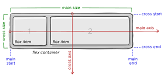

# Getting familier with React Native

## flex
React Native uses a Flexbox layout system similar to CSS, which makes it easier to build responsive and adaptive interfaces across different screen sizes.

Here are some key points:

- **flexDirection**: controls the primary axis (
  `row` for horizontal, `column` for vertical). The default is `column` on React Native.
- **justifyContent**: aligns children along the primary axis (`flex-start`, `center`, `flex-end`, `space-between`, `space-around`, `space-evenly`).
- **alignItems**: aligns children along the secondary axis (`stretch`, `flex-start`, `center`, `flex-end`, `baseline`).
- **flex**: a number that defines how a component grows or shrinks to fill the available space. A value of `1` means the component will expand to fill any remaining space in its container. Multiple children with `flex` values distribute space proportionally.

- **flexWrap**: it is used to shift children to another line if space is full for current line. Use *"alignContent"* instead of *"alignItems"* with *"flexWrap"*.

- **flexGrow**: it is used to cover extra available space between children. Those children expands their width and cover the space.



### Examples

#### Proportional Boxes
```js
<View style={{flex: 1, flexDirection: 'row'}}>
  <View style={{backgroundColor: 'red', flex: 1}} />
  <View style={{backgroundColor: 'blue', flex: 2}} />
</View>
```
The container divides its space into three units; the red box takes one unit, the blue box two units.

#### Full-screen Divisions
Use `flex` on top–level children to split the whole screen:
```js
<View style={{flex: 1}}>
  <View style={{flex: 1, backgroundColor: 'yellow'}} />
  <View style={{flex: 2, backgroundColor: 'orange'}} />
  <View style={{flex: 3, backgroundColor: 'green'}} />
</View>
```
Here the screen is split vertically into six equal parts; the yellow, orange, and green areas get 1/6, 2/6 and 3/6 of the height respectively.

Using numeric `flex` values is the most straightforward way to create screen subdivisions. They automatically adjust to device dimensions, making layouts robust and adaptive.

> **Tip:** Unlike web, React Native's layout always uses `flex` by default; most components default to `flexDirection: 'column'`.

Using Flexbox is the recommended way to manage layouts in React Native, allowing components to adapt nicely across different device resolutions and orientations.

