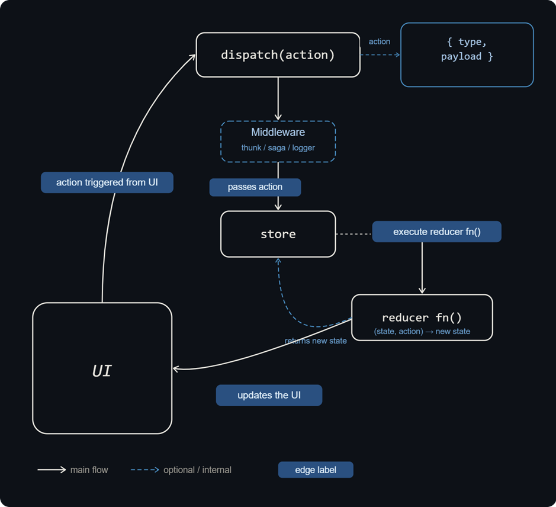

# Redux Foundational Knowledge:

- The redux is a popular pattern to maintain global state of JS applications.

- Here, the UI triggers event i.e., <code>**action**</code>, which then goes to <code>**reducer**</code> that updates the state.

- <code>**useReducer()**</code> hook mirrors the pattern of <code>**Redux**</code>.

- Below is the flow of <code>**Redux**</code>, updating the global state.

    

## Middleware:

1. <code>**redux-logger**</code>

    - This is used to log the entry whenever the action is dispatched.

    - Code:
        ```js
        import { applyMiddleware } from "redux";
        import logger from "redux-logger";

        // this will log everytime when action will be dispatched
        const store = createStore(reducer, applyMiddleware(logger.default));
        ```

2. <code>**redux-thunk**</code>

    - 

## Dos for Redux:

- Use Redux Toolkit — it's the officially recommended way and eliminates 80% of the boilerplate
- Keep state minimal and serializable (plain objects, arrays, primitives only)
- Put computed/derived data in selectors, not in state
- Split reducers by feature domain using combineReducers or slices
- Use createAsyncThunk for async flows — it auto-generates pending/fulfilled/rejected action types
- Subscribe components to only the state slices they need via fine-grained useSelector calls

## Don'ts for Redux:

- Never mutate state directly inside a reducer — always return a new object
- Don't store non-serializable values (class instances, functions, Date, Set, Map, Promises)
- Don't perform side effects inside reducers (setTimeout, setInterval, API calls, etc.) — they must stay pure
- Don't use Redux for local UI state (modals, hover, form inputs) — useState is the right tool
- Don't write async logic inside reducers — that belongs in middleware
- Don't build one giant reducer — it becomes impossible to test and maintain
- Don't add Redux to small apps just because it exists — if useState/useContext is enough, use that

## Important Reads:

- https://redux.js.org/tutorials/fundamentals/part-1-overview