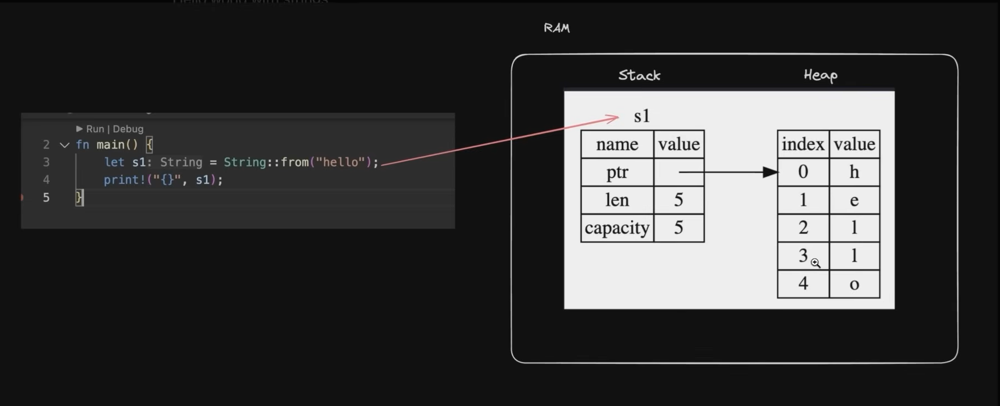
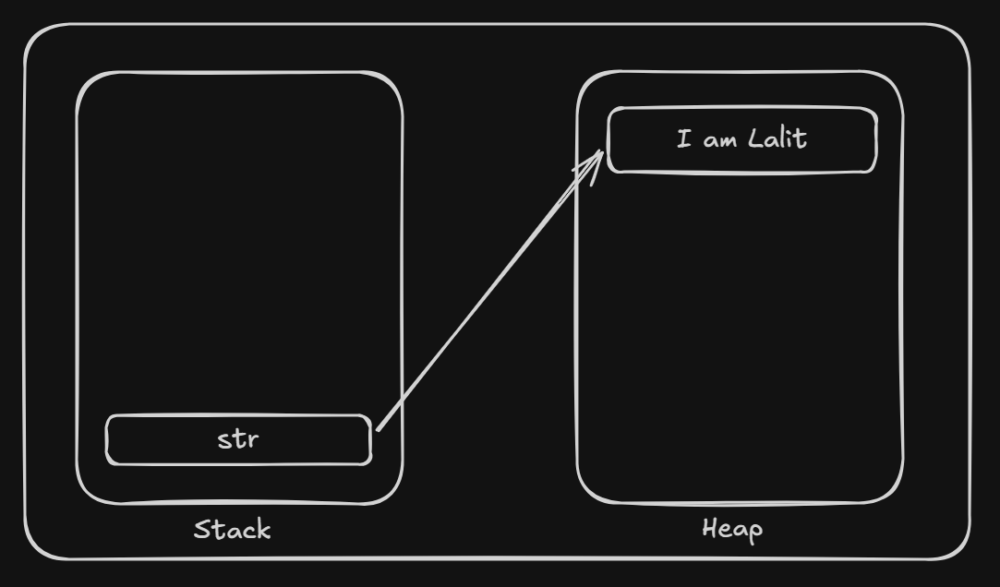
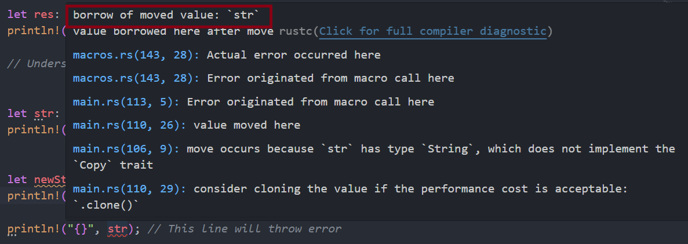
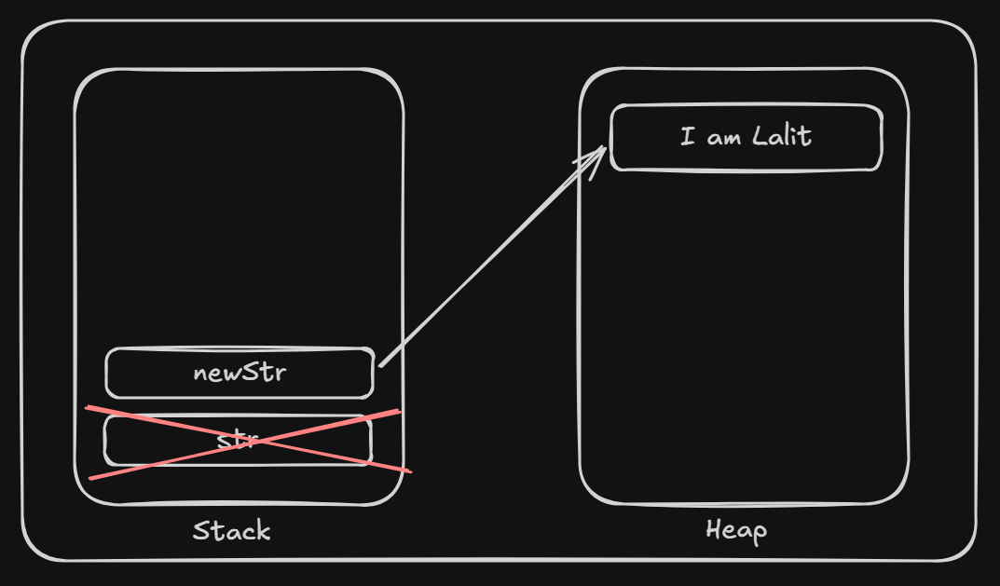
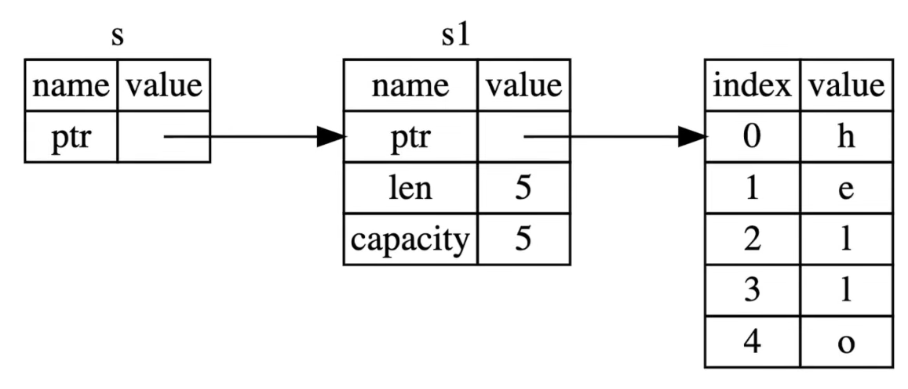

# Memory Management in Rust:

1. **Garbage Collector:**
   - This is used in Java/Javascript, etc... languages

   - Developer don't have to worry about memory management

   - <code>**Garbage Collector**</code> automatically removes the unused variables from memory

2. **Manual Memory Management:**
   - Languages like C/C++, etc... don't provide **GC**

   - It's developer's overhead to tackle with memory management, <code>**calloc, malloc, realloc, free**</code>

   - If not handled properly then memory leak/full issues are common

3. **Rust's way of managing memory:**
   1. It provides manual memory management, but with some rules<br>
      1. <code>**Mutability**</code>
         - By default every variable in rust is <span style="color: rgb(255, 117, 117)">**immutable**</span> (constant)
         - <code>mut</code> keyword is used to make variables mutable

           ```rs
           // Immutable variable
           let a: i8 = 10;

           // Mutable variable
           let mut x: i8 = 5;

           ```

         - Immutable data is inherently thread-safe because if no thread can alter the data, then no synchronization is needed when data is accessed concurrently

         - Knowing that certain data will not change allows the compiler to optimize code better

      2. <code>**Heap and Stack**</code>
         Rust has clear rules about stack and heap data management:
         - <code>**Stack**</code>: Fast allocation and deallocation. Rust uses the stack for most primitive data types and for data where the size is known at compile time (eg: numbers).

         - <code>**Heap**</code>: Used for data that can grow at runtime, such as vectors or strings.

         - <code>**Storing strings**</code>: (Looks similar with <span style="color: orange">**Java**</span>)

             

      3. <code>**Ownership Model**</code>

         - This model is for the variable whose value is stored on <code>**Heap**</code>

         - Multiple <code>**variables (owners)**</code> cannot point to same location on <code>**Heap**</code>

         - If the <code>**owner**</code> of the an allocated space on heap is deleted then allocated space will also be clear

         - Code:
            ```rs
            let str: String = String::from("I am Lalit");
            println!("{}", str);
            ```
            
         
         - If I assign the reference variable <code>**str**</code> to <code>**newStr**</code> then previous <code>**str**</code> will no longer be to accessible.

         - Code:
            ```rs
            let newStr: String = str;
            println!("{}", newStr);

            println!("{}", str); // This line will throw error
            ```
            
            


      4. <code>**Borrowing and Referencing**</code>

         

         - Types of references:
            - Immutable references: <code>&str</code> (you can have unlimited simultaneous borrowers)

               ```rs
               // Created a string
               let s1: String = String::from("Hi there!");

               // Passed reference as immutable
               let s2: &String = &s1;

               // Both will print the same output
               println!("{}", s1);
               println!("{}", s2);
               ```
            - Mutable references: <code>&mut str</code> (you can have exactly one borrower)
               
               ```rs
               // created a mutable string
               let mut s5: String = String::from("I am learning Rust.");
               println!("{s5}");

               // borrowed the string with mutability
               let s6: &mut String = &mut s5;

               // mutated the string via "s6" - mutable reference
               s6.push_str(" From Harkirat");
               println!("{s6}");
               ```
         
         - There can be either multiple readers <code>Immutable References</code> or a single writer <code>Mutable Reference</code>, both cannot be there in the code at same time.

         - Code that will throw error:
            ```rs
            let r4 = &s;
            let r5 = &mut s;
            println!("{r4}, {r5}"); // compile error! (Lifetime of "r4" is not ended)
            ```


      - Lifetimes
