# Creating Account on Solana using Solana CLI for Devnet

## Step 1: Generate a Key-Pair
- Open CMD and type following command

    ```js 
    solana-keygen new
    ```
    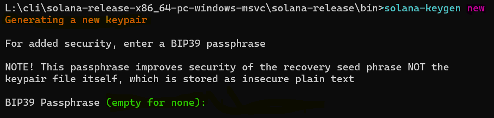
    
    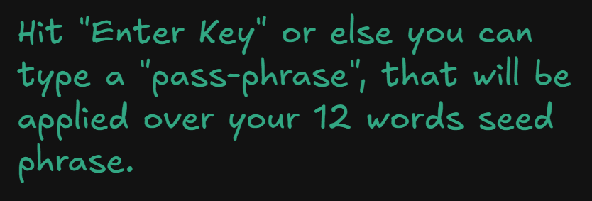

- If key-pair is generated, then you will see the following output

    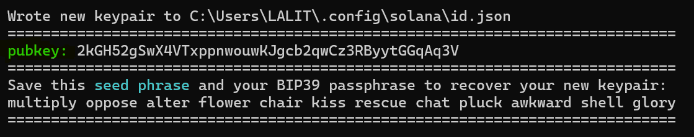

## Step 2: Airdrop some SOL 

- Link: <a href="https://faucet.solana.com">faucet.solana.com</a>

    

<br>

- Check the config for RPC URL (should be Devnet)

    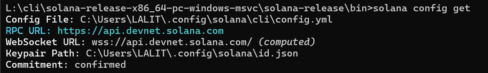
<br>

- If not set to <span style="color: #00ffbd;">**Devnet**</span>, then type this command in CMD

    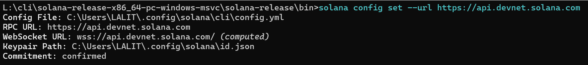

<br>

- After connecting to <span style="color: #00ffbd;">**Devnet**</span>, check the balance

    ``` js
    solana balance
    ```

    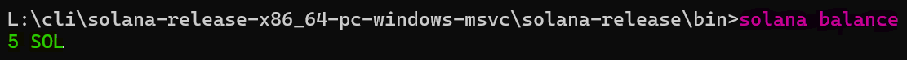

## Step 3: Create Token Mint

- Type below command in CMD

    ``` js
    spl-token create-token
    ```
    <br>
    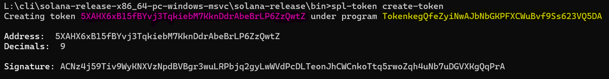
<br>

- View it on <a href="https://explorer.solana.com/">explorer.solana.com</a>

    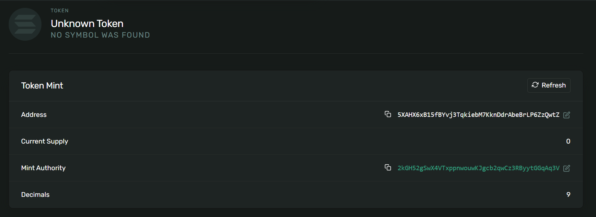

<br>

- How the <span style="color: #00ffbd;">**Token Mint Account**</span> is created?

    - First <span style="color: #00ffbd;">**System Program**</span> creates the account

        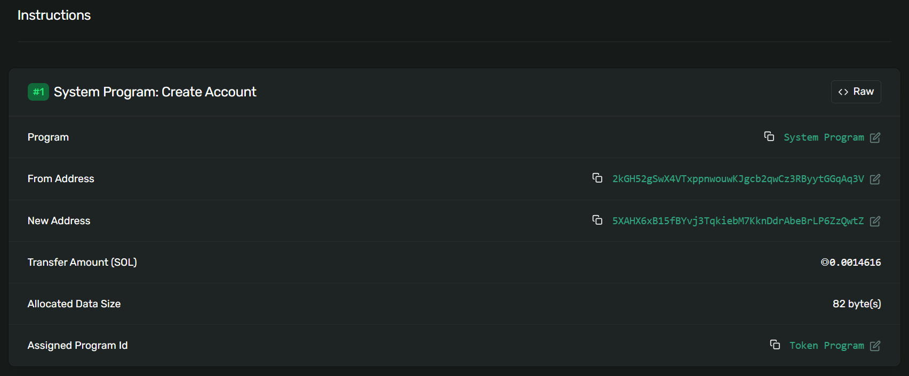
    <br>

    - Then, a CPI (Cross Program Invocation) happens and <span style="color: #00ffbd;">**Token Program**</span> initializes the mint

        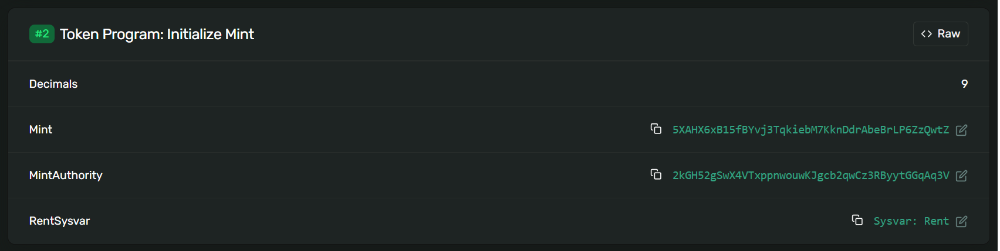
    <br>

    - Then, <span style="color: #00ffbd;">**Compute Budget Program**</span> calculates Gas Fees

        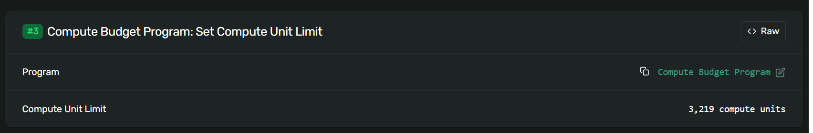
    <br>

## Step 4: Create ATA (Associated Token Account) to hold Token for myself

- Write following command in CMD

    ``` js
    spl-token create-account 5XAHX6xB15fBYvj3TqkiebM7KknDdrAbeBrLP6ZzQwtZ
      "cli"     "function"             "Token Mint Address"
    ```
<br>

- The ATA for this Token Mint is created

    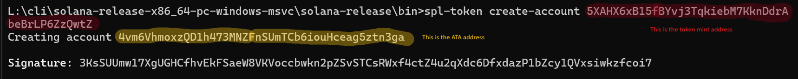
<br>

- View on <a href="https://explorer.solana.com/">explorer.solana.com</a>

    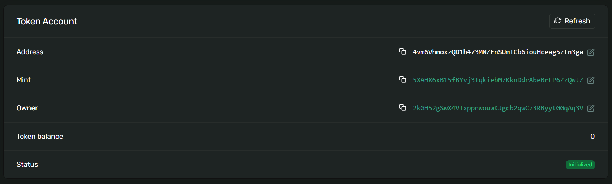

<br>

- How the <span style="color: #00ffbd;">**Associated Token Account**</span> is created?

    - <span style="color: #00ffbd;">**Associated Token Program**</span> creates the **Associated Token Account**

        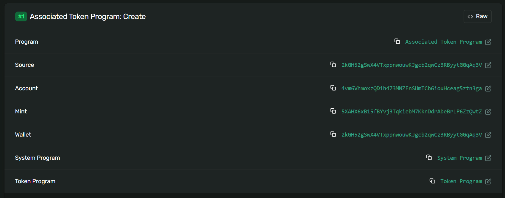

