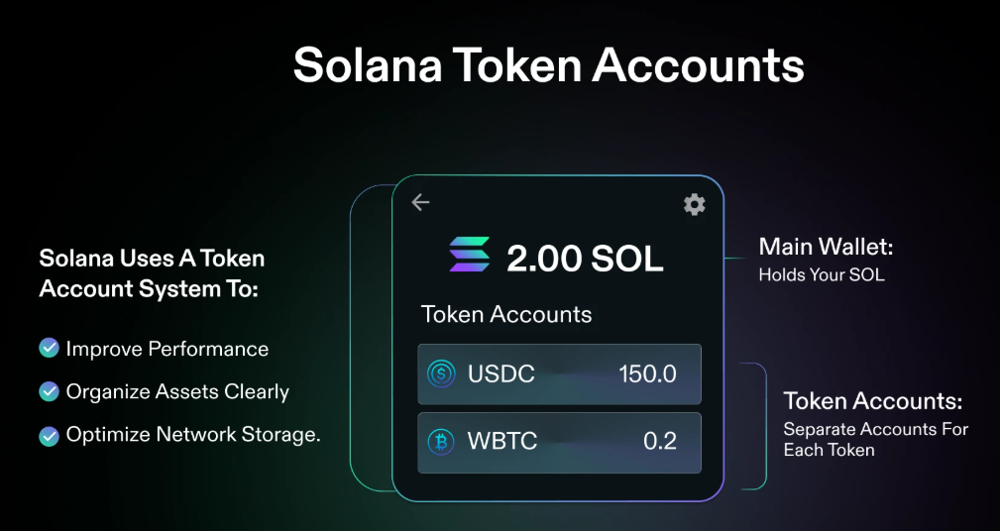

# How Token Accounts work?

  Unlike some networks where all assets share one address, Solana uses a token account system:

- Main Wallet: Holds your SOL
- Token Accounts: Separate accounts for each token type

### Why Token Accounts?
- Better performance and organization
- Clear separation of different assets
- Efficient network storage
 

### Account Rent
- Each token account requires ~0.002 SOL deposit
- This "rent" is refundable when closing the account
- Prevents spam and funds network storage
- Typically costs $0.20-0.50 per token type

## Managing Your Tokens

### Receiving Tokens
- Share your wallet address
- Sender initiates transfer
- Wallet creates token account if needed
- Tokens appear in your wallet