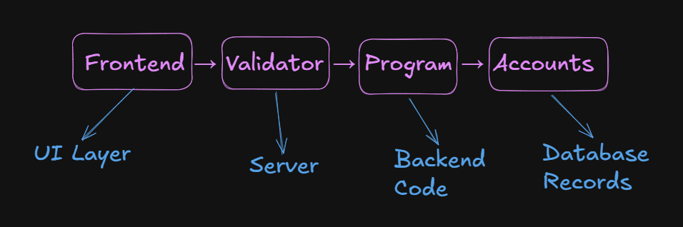
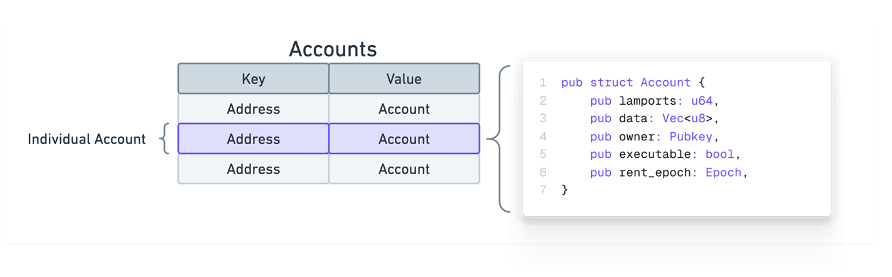
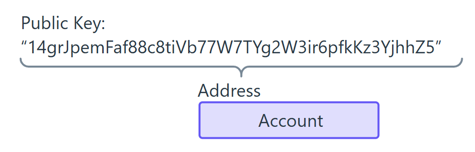
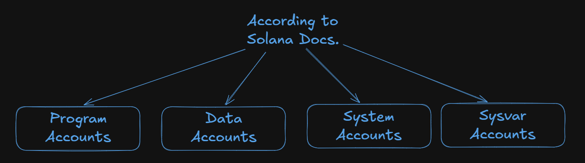
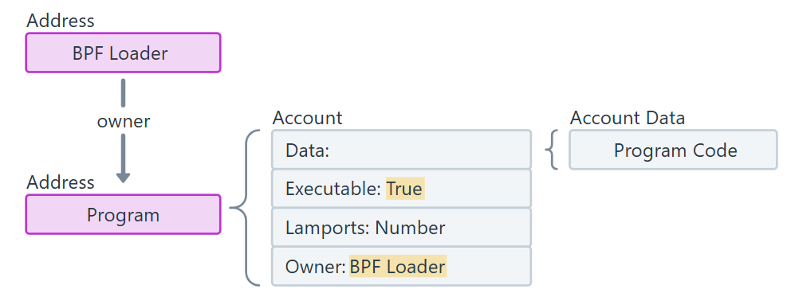
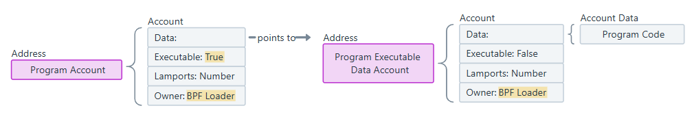
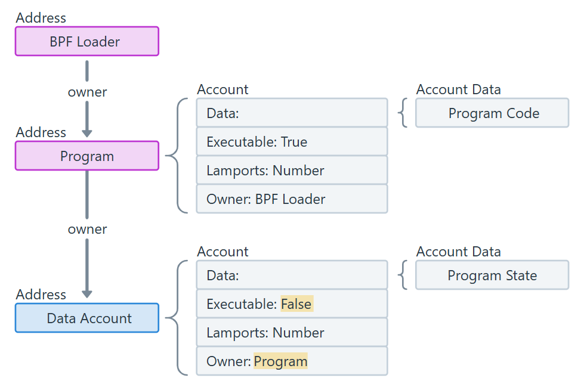

# Accounts on Solana

 
All data on Solana stores in accounts.
 
 

## Account address

- 32 byte address, in base58 encoded
- Most accounts use **Ed25519** algorithm to generate key

## Account structure
Every Account has a maximum size of 10MiB (Mebibytes) equal to **2^20 bytes** and contains following information:

- **lamports**: The number of lamports in the account
- **data**: The account's data
- **owner**: The ID of the program that owns the account
- **executable**: Indicates whether the account contains executable binary
- **rent_epoch**: The deprecated rent epoch field

### 1. Lamports
- Account's balance
- Smallest unit of SOL
- Every account must have minimum lamport balance called **rent**, to store data on-chain
- Rent is proportional to size of account
- When account is closed rent is recovered

### 2. Data
- Stored data on account
- In Program account case, this field stores executable code, in form of bytes or **Program Account Address** where the executable code is stored

### 3. Owner
- This field contains the program ID(address) of the account's owner
- This can modify the data of any account, whose owner is this
- Cannot be null

### 4. Executable
- This field tells that the account is **Program Account** or not

### 5. Rent epoch
- This field tells the rent an account need to pay for storing info

## Types of Accounts
 

- **Note: All types of accounts must have an owner**, otherwise **error** will be thrown while account creation time
 
 

### Program Accounts

 

- Used to hold programs/smart-contracts code, their **executable** field is marked as **true**
- Every Program Account is owned by **Loader Program** which is used to deploy and manage the program

    - Few things about **Loader Program**:
        - Deploys program code, by creating program account
        - Marks program as executable
        - Loads bytecode into runtime memory
        - Handles program upgrades

- A Program Account does not directly store the **data** or **executable code**
- A **Program Data Account** stores the executable code
 
 

### Data Accounts / Program State Accounts

- Do not contain executable code

    - To create a **Program State Account**:
        - Invoke **System Program** to create the account
        - After creation of new account the ownership is transferred to a new program
        - Account data gets initialized

 

 

- BPF loader creates a Program Account -> Program Data Account -> Program code is stored
- When Program executes a Data account is created by **System Program**
- Then data is stored in this account