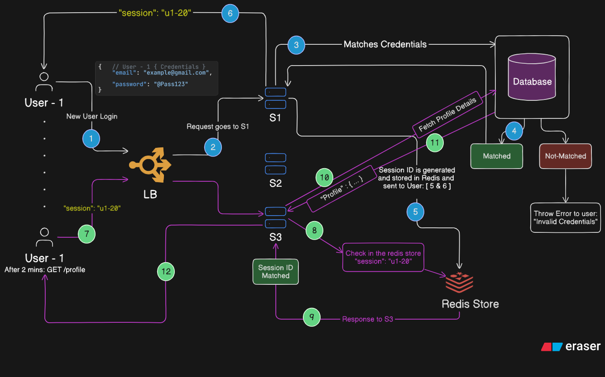

# Stateful Authentication

- Token is shared to **User** and also stored in the **Redis Store** or any other in-memory cache and not in a **Database**, because it provides faster reads than a *DB*.

- **Pros:**
    - High Security
    - Server has control to force logout the user if any shady (malicious) things happen
    
- **Cons:**
    - Hard to scale (if multiple servers)
    - High memory usage

- **Usage:**
    - Banking apps
    - Financial apps in companies

- **Flow of Stateful Authentication**

    