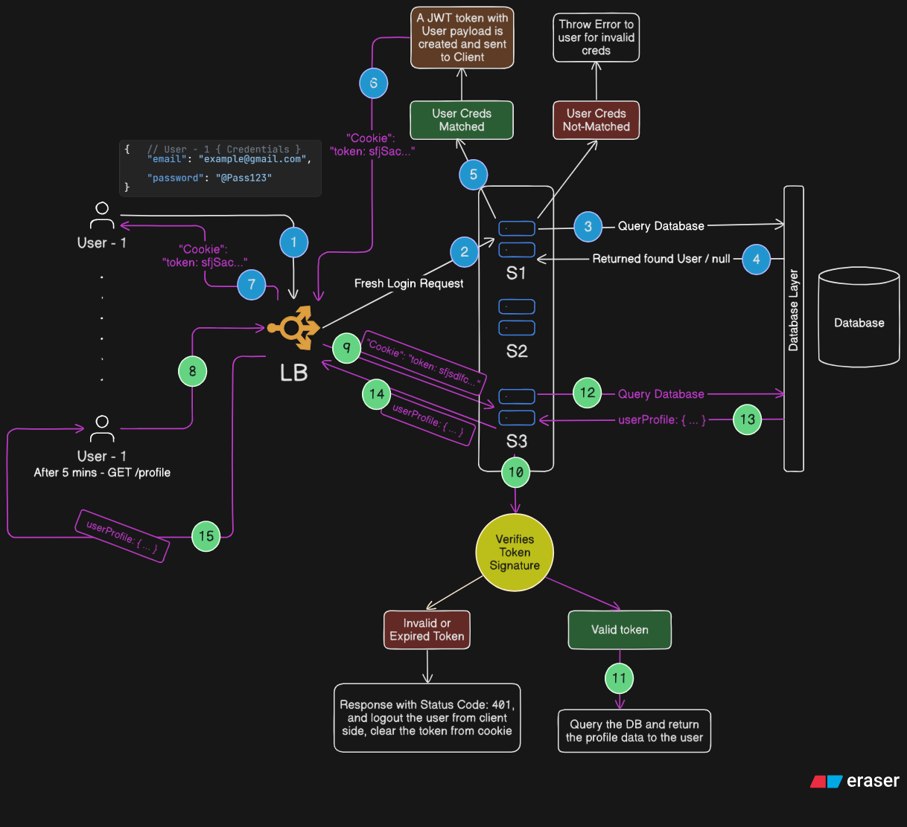

# Stateless Authentication

- Token is not stored
- It is sent to client
- **JWT (JSON Web Token)** is most commonly used

- **Pros:**
  - No storage needed on server for storing token
  - Easy implementation
  - A good developer experience

- **Cons:**
  - Force logout is not possible, suppose the user performed <code>/logout</code>, and the token expiry time is left, then it can be used again to <code>/login</code>, if **(🕵🏻) - attacker** steals the token it can easily get the access
    - For force logout **blacklist token** storage should be maintained
    - As soon as the user <span style="color: rgb(255, 102, 102)">**logs out**</span>, the token should be pushed in the blacklist token storage _(again a Redis Store)_
    - This implementation makes it Stateful again, but rather than storing full **JWT Token** we store <span style="color: rgb(255, 204, 77)">**JTI (JSON Web Token Identifier)**</span> ID in blacklist token storage _(again a Redis Store)_
    - Code example:

      ```js
      import jwt from "jsonwebtoken";
      import crypto from "crypto";

      const jti = crypty.randomUUID();

      const token = jwt.sign(
        {
          userId: user._id,
          jti: jti,
        },
        env.JWT_SECRET,
        {
          expiresIn: "15m",
        },
      );
      ```

- **Flow of Stateless Authentication**

    

