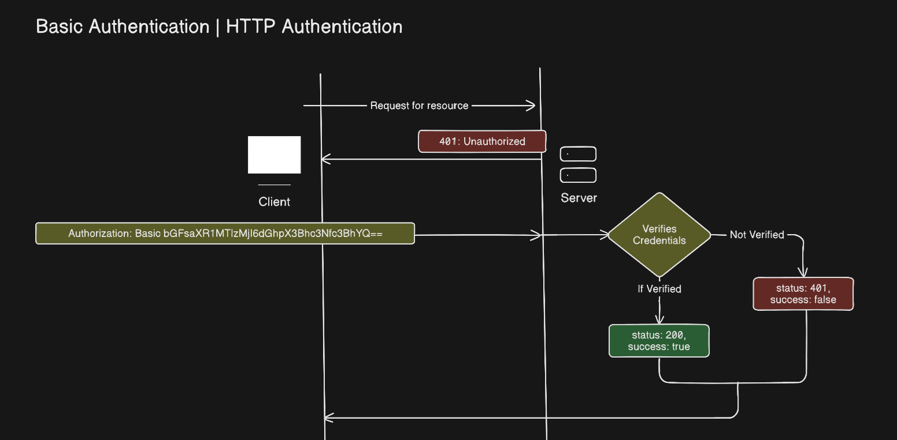

# Basic Authentication:

- Should be used in HTTPS/TLS environment, because base-64 encoded credentials are decodeable

- Here <code>**Basic**</code> scheme is used in <code>**Authorization**</code> request header

- Scheme is a standard rule/protocol defined by <code>**IANA**</code> — "Internet Assigned Numbers Authority"

- Flow of Basic scheme auth:

    