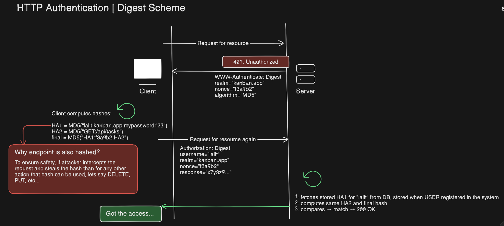

# Digest Authentication:

- It is secure then <code>**Basic**</code> authentication

- It hashes the password and a nonce that server sends, together using MD5 algorithm and then send a gibrish text to server

- Flow of Digest Authentication:

    