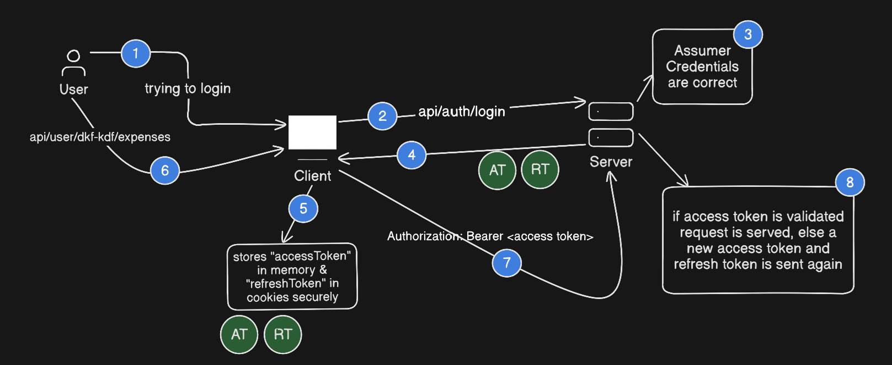

## Before two tokens (Access & Refresh):

- This is the time when only 1 JWT token was used

- A token has payload (or data) of user, and that token is stored either in localstorage of browser or cookies

- **Important points to keep in mind here**:

    - **Case 1:** Token stored in <code>localstorage</code> => If our application is vulnerable, then hacker can run any malicious script, to fetch the token from localstorage, because of same domain <span style="color: rgb(255, 143, 143)">**(XSS Attack) - Cross-Site Scripting**</span>

    - **Case 2:** Token stored in <code>cookies</code> => If we visit a malicious site and it has some form like below:

        ```html
        <!-- Evil website opened -->
        <form action="https://facebook.com/post" method="POST">
            <input name="message" value="hacked!" />
        </form>
        <script>document.forms[0].submit()</script>
        ```

        This form is submittng the request to <code>Facebook</code>, which will use my cookie stored by facebook for authentication purpose. <span style="color: rgb(255, 143, 143)">**(CSRF Attack) - Cross Site Request Forgery**</span>

        Use **SameSite** with **Strict** like this => ```Set-Cookie: refresh_token=xyz; HttpOnly; SameSite=Strict```

        It ensures that the site which is attaching the cookie with request should be the same who sent it.


## Working of Access & Refresh Token:



- **Keep in mind:**

    - When new Access Token is generated than also generate new Refresh Token because refresh tokens are long lived

    - Always store Refresh Token in cookies with ```secure: true, httpOnly: true, sameSite: strict, maxAge: 7d```

