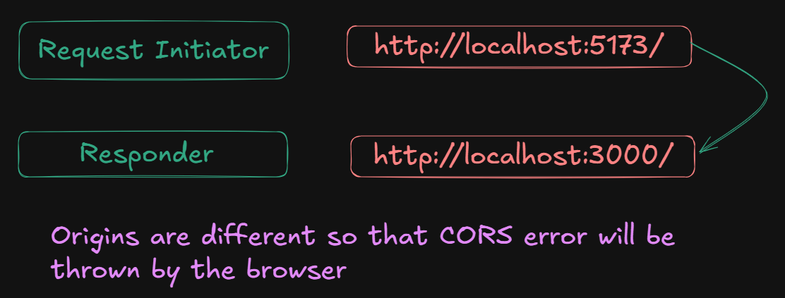

## CORS:

- Browser shows <code>**CORS**</code> error because of safety, if frontend domain is sending a request to another domain, <code>**ex: application's backend**</code>.

- According to <code>**Same-Origin Policy**</code> browser says, that request initiater and responder should be at same origin.

- <code>**Origin**</code>: protocol + domain + port

    


## Headers:

- Headers are meta-data of request & response.

## Types of Request:

- <code>**Simple Request**</code>:

    - HTTP method is one of these three only: <code>GET</code> | <code>POST</code> | <code>HEAD</code>

    - Only these headers are allowed with request: <code>Accept</code> | <code>Accept-Language</code> | <code>Content-Language</code> | <code>Content-Type</code>

    - Only these <code>Content-Type</code> values are allowed: <code>text/plain</code> | <code>multipart/form-data</code> | <code>application/x-www-form-urlencoded</code>

- <code>**Preflight Request**</code>

    - Using these HTTP methods: <code>PUT</code> | <code>PATCH</code> | <code>DELETE</code>

    - Using custom headers: <code>Authorization</code> | <code>X-CSRF-Token</code> | <code>X-Requested-With</code>, etc...

    - Sending <code>Content-Type</code> as <code>application/json</code>

    - Before actual request a <code>pre-flight request</code> is sent to the server, to ask for permissions like;

        - Is this origin allowed?

        - Are these HTTP verbs allowed?

        - Is this Content-Type allowed?

## To prevent CORS Server should respond with these headers:

```js
// Who is allowed to call you
res.setHeader("Access-Control-Allow-Origin", "http://localhost:5173");
// Use "*" for public APIs, but "*" won't work with credentials

// Which HTTP methods are allowed
res.setHeader("Access-Control-Allow-Methods", "GET, POST, PUT, PATCH, DELETE, OPTIONS");

// Which request headers the browser is allowed to send
res.setHeader("Access-Control-Allow-Headers", "Content-Type, Authorization");

// Allow cookies / auth tokens to be sent cross-origin
res.setHeader("Access-Control-Allow-Credentials", "true");

// How long (seconds) browser should cache the preflight result
// So it doesn't send OPTIONS every single time
res.setHeader("Access-Control-Max-Age", "86400"); // 24 hours
```